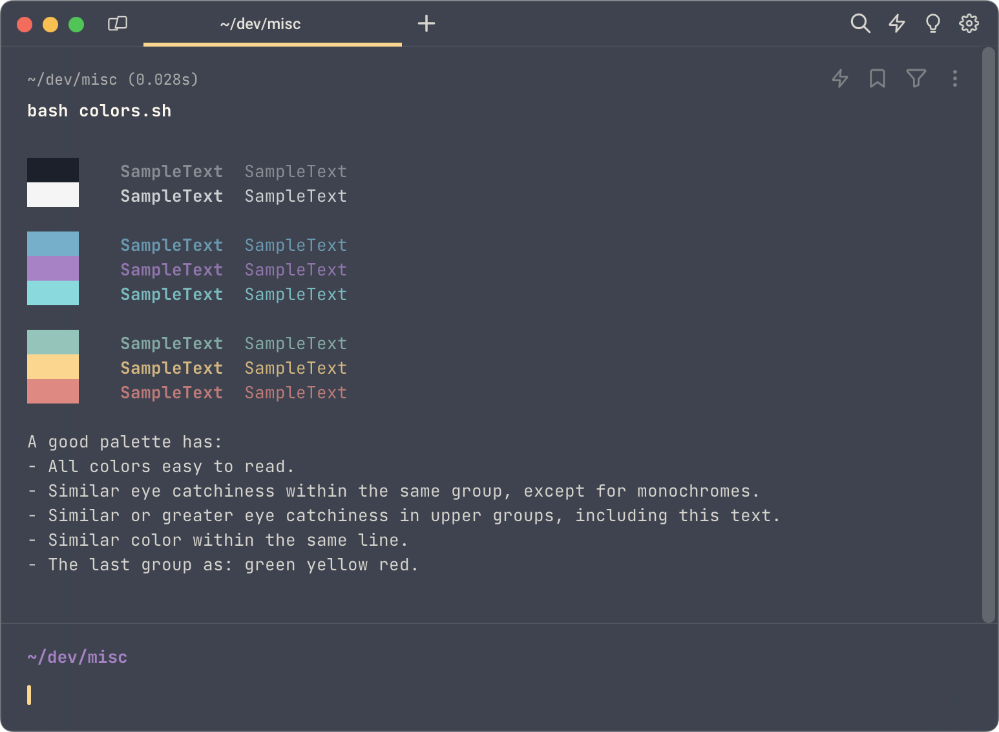
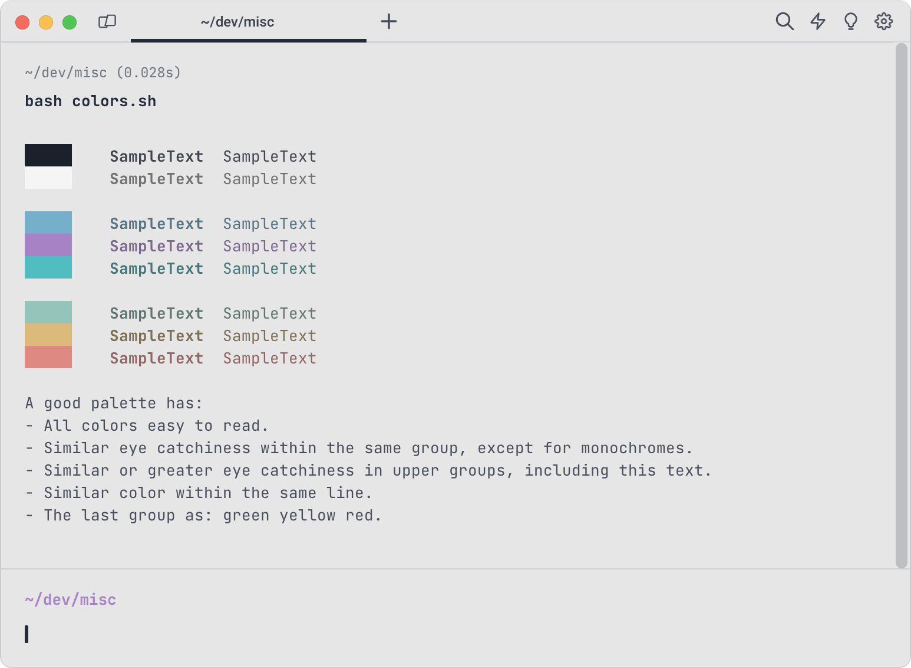

# Warp Night Shift & Day shift themes

A port of my vscode themes ([Night Shift](https://github.com/Jean-Tinland/vscode-theme-desaturated) and [Day Shift](https://github.com/Jean-Tinland/vscode-theme-day-shift)) for Warp Terminal.\
You'll find a Google Chrome theme [here](https://github.com/Jean-Tinland/chrome-theme-desaturated) and a iTerm2 theme [here](https://github.com/Jean-Tinland/iTerm2-theme-desaturated).

## Preview

### Night Shift

### Day Shift

Displayed colors output: [colors](https://gitlab.com/es20490446e/colors).\
Used font: [JetBrains Mono](https://www.jetbrains.com/lp/mono/).

## Installation

Download both the themes files (.yaml) and copy it to your warp themes folder (usually `~/.warp/themes/`).

Once copied, you can select the theme in Warp settings.
